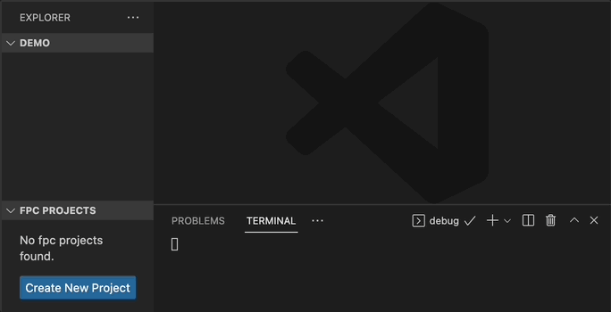
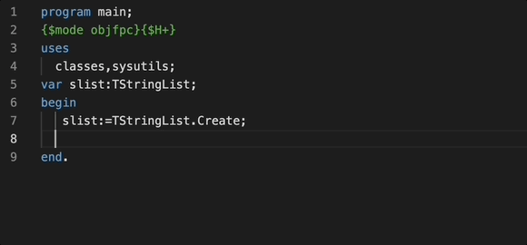
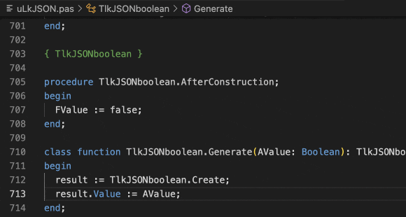

# FreePascal Toolkit 
`FreePascal Toolkit` is a VSCode extension for developing FreePascal applications.

[中文文档](README_CN.md)
## Requirements

- Install [Lazarus](https://www.lazarus-ide.org/) or  [FreePascal](https://www.freepascal.org/download.var)  on your system. 

- The extendsion will auto search the path of fpc. If it's not be found, please set the system PATH environment variable, or set `fpctoolkit.env.PP` in vscode's user setting. 

- Install [GDB Debugger - Beyond](https://marketplace.visualstudio.com/items?itemName=coolchyni.beyond-debug) to debug your freepascal program .

## Features
- build freepascal program 
	- Build 
	- Rebuild
	- Clear
- explorer build tasks
	- Customize build tasks
	- Inherted from other task
- code snippets
	- A lot of snippets for code quick edit.
		* class
		* if-else
		* begin-end
		* ... 
- auto completion
 	
	
	
- gotoDeclaration, gotoDefinition
	- Use `ctrl+up`,`ctrl+down` to jump between declaration and implementation.
- class and function references
		
	
	
- documentHighlight
	- High light for source code 
	- Identify the compilation conditions for the definition. `{$IFDEF} {ELSE} {$ENDIF}`

- code format with [jcf cli](https://github.com/coolchyni/jcf-cli)

	 
	
	- Format source code
	- Use `jcfsettings.cfg` as config. Will use lazarus's config if it installed. 
- quick fix 
	- Quick fix for `(5025) Local variable "xxx" not used`
  
 	 

- auto rename symbols
	- Rename function,procedure,variable and it's reference. 
- code complete 
	- Use `ctrl+shift+c` auto implement procedure .
- code actions
	- remove unused units
## Pascal Language Server 

from [pascal-language-server](https://github.com/coolchyni/pascal-language-server)

An [LSP](https://microsoft.github.io/language-server-protocol/) server
implementation for Pascal variants that are supported by [Free
Pascal](https://www.freepascal.org/), including Object Pascal. It uses
[CodeTools](https://wiki.lazarus.freepascal.org/Codetools) from
Lazarus as backend.

## Freepascal Task Settings

You can add freepascal compile tasks by editing `task.json` in your .vscode folder.

The task's type is `fpc`. It contains the following configuration items.

### Task settings
Field   | type  |  Description  |
------  | ----- |  :-------------
file  | string|main program file. .lpr or .dpr
type  | string|always be `fpc`
cwd   | string|current path. Use wrokspace root if null.
cleanExt|string|file extensions for clean file in unitOutputDir. use * for clear all file. default:(.o,.ppu)
buildOption|object|build options
inherited|string| inherit from other task

### buildOptions
Field  | type | Description  |
-------| ---- |:---------------
targetOS  | string | Target OS (-T).  eg. `linux` `win64`
targetCPU |string| Target cpu family (-P). eg. `x86_64` `i386`
customOptions|string []| Any compile options for fpc.     
libPath|string[]|Searchpath for libraries.(-Fl)
outputFile| string| Target file name.(-o)
unitOutputDir| string|Unit output directory.(-FU)
optimizationLevel| number|Optimization levels (-O)
searchPath| string[]|Searchpath for units and other system dependent things.(-Fu)
syntaxMode| string|Syntax Mode (-M)
forceRebuild| boolean|Re-compile all used units, even if the unit sources didn’t change since the last compilation.(-B)
msgIgnore|number[]|Is a list of messages numbers which should not be shown.(-vmxxx)

example:
~~~json
{
	"version": "2.0.0",
	"tasks": [
		{
			"label": "debug",
			"file": "main.lpr",
			"type": "fpc",
			"buildOption": {
				"unitOutputDir": "./out",
				"customOptions": [
					"-dDEBUG",
					"-gw2"
				]
			}
		}
	]
}
~~~

# Thanks
## HighLight

Syntaxes from https://github.com/maresmar/ST-Pascal

## Format

Clone and modified from  https://github.com/git-bee/jcf-cli

## Pascal-language-server

Clone and modified from 
https://github.com/genericptr/pascal-language-server 
https://github.com/arjanadriaanse/pascal-language-server

# Release Notes

[view changelog](CHANGELOG.md)

